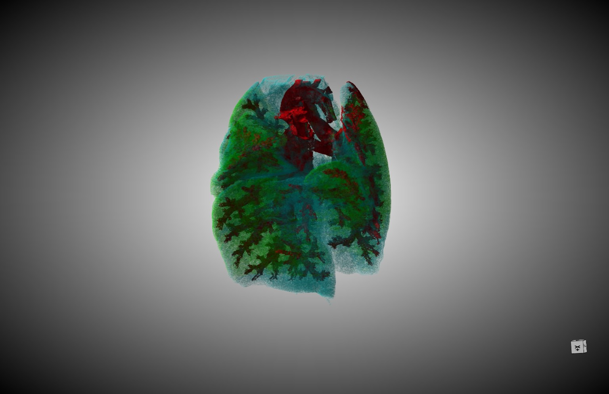
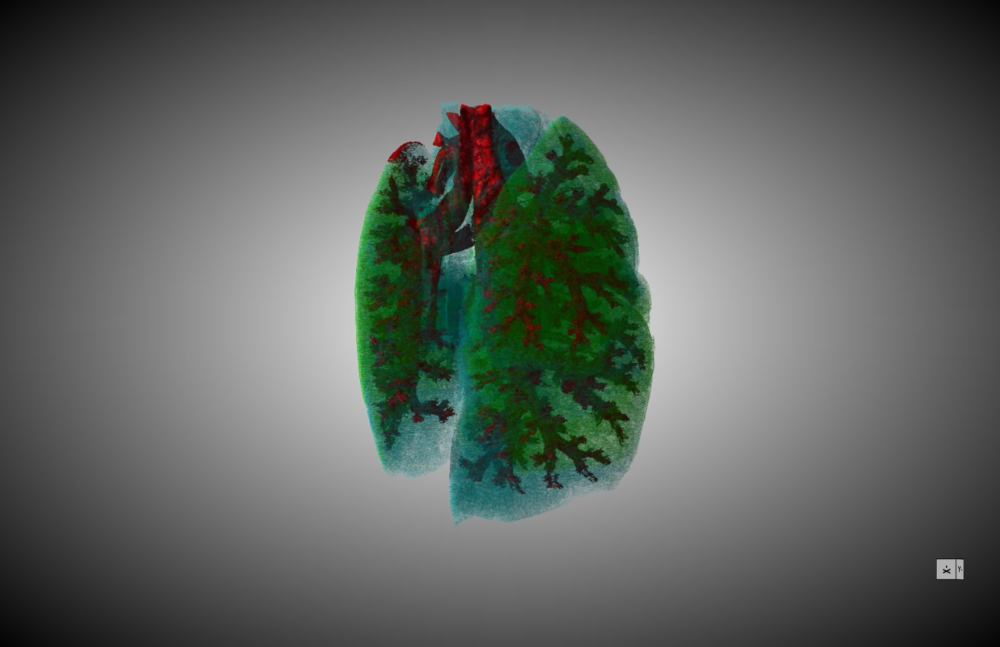
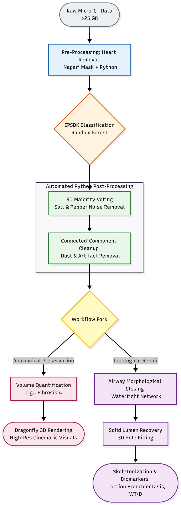

# Automated-3D-Micro-CT-Analysis-Pipeline-for-Idiopathic-Pulmonary-Fibrosis-IPF-
Automated Python post-processing for 3D Micro-CT imaging: features 3D majority voting, artifact removal, and precise volume quantification.

  
  
   
  <em>High-resolution 3D cinematic rendering of fibrotic lung tissue (Dragonfly).</em>

**Overview:** 
This repository contains the automated Python pipeline developed during my Erasmus+ Research Internship at INSERM and Université Grenoble Alpes (UGA). The project addresses the challenge of quantifying disease biomarkers in Idiopathic Pulmonary Fibrosis (IPF) using ultra-high-resolution X-ray Phase Contrast Micro-CT imaging.

The core engineering challenge: Processing massive volumetric datasets (>25 GB per scan) that cause standard memory overflows, while eliminating manual, subjective assessment of over 3,000 2D slices per sample.

**Pipeline Architecture:** 
The pipeline acts as the automated post-processing and quantification engine following a Random Forest tissue classification (via IPSDK / nnInteractive). 

  

1. Pre-Processing & Classification Optimization 
- Anatomical Isolation: Automated heart removal and masking strategies to isolate the lung parenchyma.
- Multi-Scale Feature Processing: Utilizing Variance, Gaussian, and Laplacian filters across different scales for texture and edge detection.

2. Automated Post-Processing (Noise & Artifact Mitigation)
- 3D Majority Voting: An efficient algorithm to eliminate 'Salt-and-Pepper' noise (isolated misclassified pixels) while strictly preserving true tissue boundaries.

  
   
  <em>Before and After: Elimination of classification noise using 3D Majority Voting and Connected-Component cleanup.</em>

- 3D Connected-Component Analysis: 
        - Dust Removal: Identification and deletion of floating artifacts outside the lung parenchyma.
        - Context-Aware Smart Replacement: Reassignment of misclassified internal islands based on the dominant surrounding tissue.
 
 3. Biomarker Extraction & Topological Repair
- Branch A: Anatomical Preservation & Quantification
        - Automated voxel counting to calculate exact volumes ($mm^3$) and percentages for Healthy Tissue, Fibrosis, Airway Walls, and Mediastinum.
         Provides stable, reproducible 3D metrics, proving pathological stability over background algorithmic noise.

- Branch B: Topological Repair (Experimental)
        - Airway Morphological Closing to create a watertight network.
        - Solid Lumen Recovery via 3D Hole-Filling algorithms, paving the way for skeletonization and Wall Thickness to Lumen Diameter (WT/D) ratio  
extraction. 

  
   
  <em>3D extracted models of the lung airway trees, used for skeletonization and structural analysis.</em>

         
**Key Technical Features**
- RAM-Safe Processing: Code engineered to handle >25GB Micro-CT data efficiently.
- Objective Quantification: Replaces subjective manual scoring with highly reproducible volumetric metrics.
- Medical Data Handling: Adheres to biological context logic (e.g., distinguishing thick blood vessels from true pathological fibrosis).

**Tech Stack**
- Language: Python
- Image Processing: Scikit-Image, SciPy, NumPy (for large multidimensional array manipulation)
- Visualization/Integration: Napari (nnInteractive plugin), Dragonfly (for cinematic 3D rendering)

**_**Disclaimer & Data PrivacyNote: Due to IP and medical data confidentiality agreements with INSERM and UGA, the original raw Micro-CT datasets and proprietary Random Forest models are not included. The code provided here includes the core post-processing and topological algorithms, accompanied by anonymized mock data structures to demonstrate algorithmic functionality.**_**
